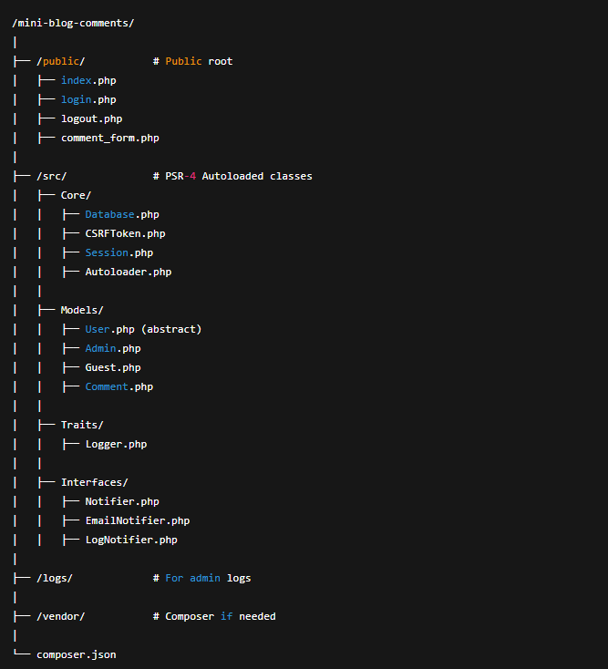

# 📝 Mini Blog Comments System

A lightweight, modular PHP mini-project built using **OOP**, **PDO**, and **PSR-4 Autoloading** — featuring user roles, session authentication, CSRF protection, and admin log monitoring.

---

## 🚀 Features

- 🧱 Object-Oriented Architecture with PSR-4
- 🧑‍💻 Basic Session Authentication (Admin & Guest)
- 🛡️ CSRF Token Protection for Forms
- 💬 Comment Posting and Admin-only Deletion
- 🗃️ MySQL-based storage using PDO
- 🔐 Simple role-based access control
- 📂 Clean directory structure following best practices

---

## 🗂️ Project Structure

